## Hi there 👋
<!--
**DQP-UIT/DQP-UIT** is a ✨ _special_ ✨ repository because its README.md (this file) appears on your GitHub profile.

Here are some ideas to get you started:

- 🔭 I’m currently working on ...
- 🌱 I’m currently learning ...
- 👯 I’m looking to collaborate on ...
- 🤔 I’m looking for help with ...
- 💬 Ask me about ...
- 📫 How to reach me: ...
- 😄 Pronouns: ...
- ⚡ Fun fact: ...
-->

    

<h1 align="center">
    
</h1>

---

### 📊 GitHub Stats  

    
    

---

### 🏆 Achievements  

    

---

### 🌍 Connect with me  

    

